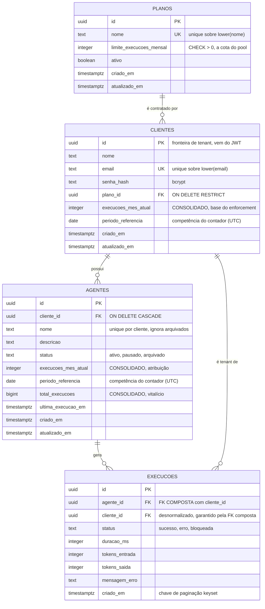
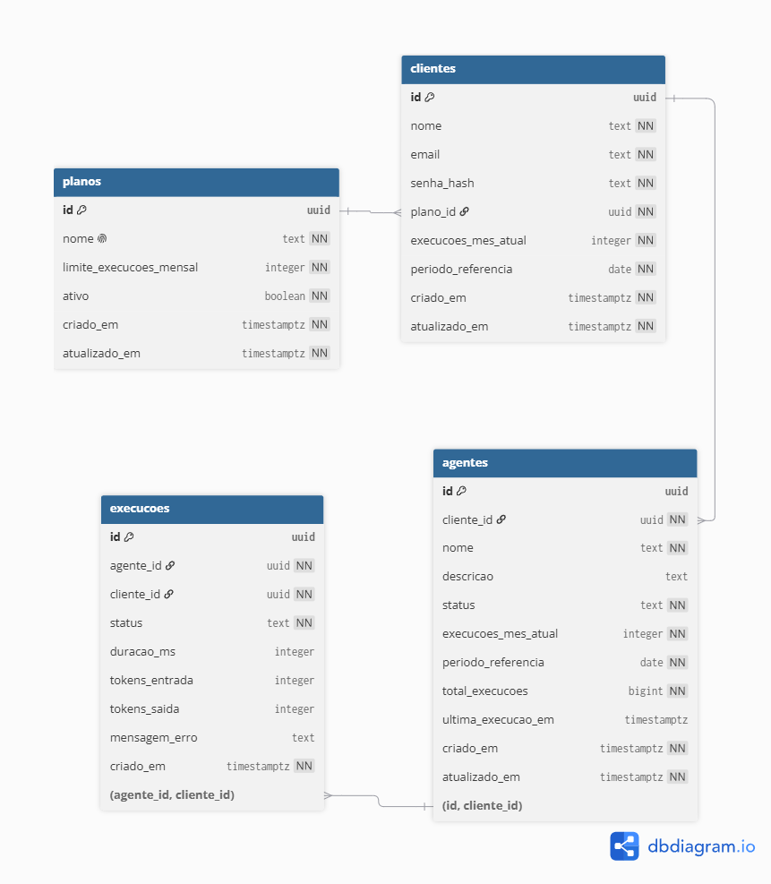

# rotik-panel-agents

**Painel de Monitoramento de Agentes de IA** · Desafio Técnico Fullstack · Rotik

MVP que permite ver, por cliente, quais agentes de IA estão ativos, quanto cada um consumiu da cota
mensal do plano contratado, e bloquear novas execuções quando o limite é atingido.

**Stack:** Node.js + TypeScript (backend) · React + TypeScript (frontend) · PostgreSQL
**Deploy:** _(link na Etapa 6)_

<details>
<summary><b>Por que essa stack</b></summary>

O desafio dá liberdade e cita Nuxt/Laravel como referência. Escolhi React + Node/TS, que também está
na stack da Rotik, por dois motivos: é onde produzo com mais densidade no tempo sugerido, e manter
TypeScript nas duas pontas permite compartilhar os tipos do contrato da API sem geração de código.

PostgreSQL, e não MongoDB, porque o problema central aqui é **cota transacional**. A regra de negócio
depende de verificar um limite e incrementar um contador de forma atômica, que é o caso clássico de
transação ACID em linha única.
</details>

## Status

Construído **por etapas**, seguindo o enunciado. Cada etapa é revisada antes da seguinte começar, e é
por isso que o histórico de commits é granular.

| Etapa | Entrega | Status |
|---|---|---|
| **0** | **Discovery** | ✅ |
| **1** | **Modelagem de dados** | ✅ |
| 2 | Backend REST API | ⏳ Próxima |
| 3 | Frontend (SPA) | ⏳ |
| 4 | Integração | ⏳ |
| 5 | Qualidade, testes e debug | ⏳ |
| 6 | DevOps (CI, deploy, env) | ⏳ |
| 7 | Mentalidade de produto | ⏳ |

**Convenção de commits:** [Conventional Commits 1.0.0](https://www.conventionalcommits.org/pt-br/v1.0.0/),
no formato `<tipo>(<escopo>): <descrição no imperativo>`.

## Índice

- [Etapa 0: Discovery](#etapa-0-discovery)
  - [Perguntas e suposições](#1-perguntas-que-eu-faria-ao-stakeholder)
  - [Entidades de negócio](#2-entidades-de-negócio)
  - [Escopo do MVP](#3-escopo-do-mvp)
  - [Riscos que decidi não resolver agora](#4-riscos-que-decidi-não-resolver-agora)
- [Etapa 1: Modelagem de dados](#etapa-1-modelagem-de-dados)
  - [Diagrama ER](#diagrama-er)
  - [Decisões de modelagem](#decisões-de-modelagem)
  - [Uso mensal sem COUNT(\*)](#uso-mensal-sem-count)
  - [Verificação empírica](#verificação-empírica)

---

# Etapa 0: Discovery

O briefing tem uma frase que decide o projeto inteiro:

> "Quando o cliente estourar o limite, o agente deveria parar de responder **(ou pelo menos a gente
> precisa saber que isso aconteceu)**."

Esse parêntese não é detalhe de redação. É o time de Produto admitindo que não sabe se está pedindo um
**mecanismo de enforcement** ou um **painel de observabilidade**. São produtos diferentes, com donos,
riscos e custos diferentes. Quase todas as perguntas abaixo saem dessa dúvida, e boa parte do meu
Discovery foi decidir como não apostar tudo em uma das duas leituras.

## 1. Perguntas que eu faria ao stakeholder

São seis, e o mínimo pedido é cinco. Todas estão aqui porque a resposta mudaria código. Para cada uma
anoto também o custo de ter errado, porque é isso que decide quanto vale discutir antes de construir e
quanto vale apenas seguir com confiança.

### 1. O limite é do cliente ou de cada agente?

O briefing diz as duas coisas. "Cada **plano** tem um limite mensal" e "quando o **cliente** estourar o
limite" apontam para o cliente. Já "quantas execuções cada **agente** fez" aponta para o agente.

**Assumi que a cota é do cliente e a atribuição é do agente.** O plano é contratado pelo cliente, então
o limite é um pool compartilhado entre os agentes dele e o bloqueio olha o contador do cliente. Junto
disso mantenho um contador por agente, porque quando o CS vê uma conta em 95% a primeira pergunta nunca
é "quanto o cliente usou", e sim "qual agente está queimando isso".

<details>
<summary>Como isso concilia as duas leituras, e o custo se eu errei</summary>

O dashboard mostra a cota do cliente, que é a que bloqueia, e dentro de cada agente quanto aquele
agente consumiu do mesmo limite. Um agente em 60/100 ao lado de outro em 22/100 é lido na hora como
"o primeiro é o problema".

Se o limite for mesmo por agente, bastaria movê-lo para o agente ou criar uma tabela de override. O
contador por agente já existe no modelo, então a migração seria aditiva e o enforcement mudaria de
linha. **Custo baixo, e isso foi de propósito.**
</details>

### 2. Quem usa o painel: o CS da Rotik ou o cliente final?

De novo, o briefing diz os dois. "Fácil de usar pelo nosso time de CS" sugere ferramenta interna, mas a
Etapa 2 pede que "um cliente não pode ver dados de outro", que é self-service.

**Assumi tenant-scoped:** a autenticação é por cliente, o token carrega o identificador dele, e toda
query é filtrada por ele. O painel de CS vem depois, como um papel `admin` capaz de assumir a visão de
um tenant.

<details>
<summary>Por que nessa ordem, e o custo se eu errei</summary>

Isolamento é a decisão irreversível. Construir tenant-scoped e depois abrir para um admin é aditivo,
basta um claim de papel no token. Construir aberto e depois tentar apertar o isolamento é uma auditoria
de vazamento em cada endpoint. Quando não dá para perguntar, escolho o caminho que erra para o lado
seguro.

Se eu errei, o CS precisa trocar de login para ver cada conta. Chato, mas o painel funciona.
**Custo baixo.** O erro inverso teria sido vazamento de dados entre clientes.
</details>

### 3. A Rotik executa o agente, ou só registra que ele executou?

Essa é o parêntese do briefing traduzido em pergunta técnica. Se a Rotik está no caminho da requisição,
a recusa deste serviço **é** o "parar de responder". Se ela só recebe logs depois, bloquear aqui não
para nada, é só um carimbo, e o produto real passa a ser o alerta.

**Assumi que a Rotik executa.** A própria descrição diz "plataforma que permite criar, configurar e
monitorar agentes", e quem configura, executa. Logo este serviço é o sistema de registro da cota: o
runtime registra a execução antes de responder ao usuário final, e uma recusa faz o agente parar.

<details>
<summary>A consequência que assumo junto, e o custo se eu errei</summary>

Esse endpoint entra no caminho crítico de latência de **todo** atendimento da Rotik. É por isso que
trato performance de leitura como requisito da Etapa 1, e não como otimização prematura.

Se eu errei, a recusa vira sinalização e as execuções bloqueadas viram o produto. O código não muda, o
que muda é o que o consumidor faz com a resposta. **Custo baixo**, e é exatamente por isso que **registro
a execução bloqueada mesmo bloqueando**. Uma tentativa recusada e gravada atende às duas leituras do
parêntese ao mesmo tempo, sem me obrigar a escolher uma.
</details>

### 4. O que conta como uma execução?

Isso é semântica de faturamento. Se erro conta, o cliente paga por falha da Rotik. Se não conta, um
agente quebrado vira compute infinito de graça.

| Situação | Consome cota? | Por quê |
|---|---|---|
| Sucesso | **Sim** | Óbvio. |
| Erro (ex.: timeout do LLM) | **Sim** | O custo de inferência já foi pago pela Rotik. Não cobrar transforma agente instável em prejuízo. |
| **Bloqueada** por limite | **Não** | Nunca chegou a rodar. Cobrar por uma recusa seria indefensável, e criaria o absurdo de a cota estourada se auto-alimentar. |
| Retry | **Sim**, cada tentativa | O modelo não distingue retry de chamada nova. |

<details>
<summary>O custo se eu errei</summary>

Mudar para "erro não conta" é uma linha de código, mas **corrige o histórico para trás com
dificuldade**, porque competências já fechadas ficariam inconsistentes. **Custo médio**, e é a suposição
desta lista que eu mais gostaria de confirmar antes de faturar em cima dela.
</details>

### 5. "Mensal" é mês calendário ou ciclo da assinatura?

Um cliente que assinou dia 22 espera que a cota vire dia 22, não dia 1º. Errar isso gera ticket de
suporte e disputa de fatura.

**Assumi mês calendário, ancorado em UTC.** É o que "limite mensal" significa em linguagem natural e
basta para o MVP. Ancoro em UTC de propósito, porque a virada precisa ser determinística: sem uma
âncora única ela aconteceria em horários diferentes conforme o fuso de quem consulta, e um cliente
poderia consumir duas cotas na fronteira.

<details>
<summary>O custo assumido e o custo se eu errei</summary>

Custo assumido: para um cliente em São Paulo, a cota vira às 21h do último dia do mês.

Se for ciclo por aniversário, seria preciso trocar a competência por uma janela `(início, fim)`
derivada da data de assinatura e reescrever a lógica de virada. **Custo médio-alto, é a suposição
estruturalmente mais cara desta lista.** Aceito porque a alternativa é modelar um ciclo de billing
completo, com proração e upgrade no meio do ciclo, que está claramente fora do MVP.
</details>

### 6. O bloqueio é hard ou existe overage?

Um bloqueio hard derruba o atendimento do cliente em produção. Nenhuma empresa corta o serviço do maior
cliente às 3h da manhã sem uma decisão comercial consciente.

**Assumi hard block, sem overage**, porque o briefing é literal: "o agente deveria parar de responder".
Toda execução recusada fica registrada, o que dá ao Comercial a lista exata de **demanda reprimida**,
ou seja, quanto o cliente teria consumido. Isso é gatilho de upsell com evidência, e é receita que hoje
se perde em silêncio.

<details>
<summary>O custo se eu errei</summary>

Overage é aditivo: um limite hard opcional no plano, ou um campo de tolerância. E os dados para tomar
essa decisão **já estarão sendo coletados** nas execuções bloqueadas. **Custo baixo.**
</details>

## 2. Entidades de negócio

| Entidade | O que é | Vira tabela? |
|---|---|---|
| **Cliente** | Empresa contratante. É a fronteira de tenant e a titular da cota. | ✅ |
| **Plano** | Catálogo comercial. Carrega o limite mensal. | ✅ |
| **Agente** | Agente de IA de um cliente. Unidade de atribuição de consumo. | ✅ |
| **Execução** | Uma chamada ao agente. Tabela de fatos, append-only. | ✅ |
| **Limite** | Citado no briefing como conceito. | ❌ atributo de Plano |
| **Competência** | A janela contra a qual a cota é medida. | ❌ atributo |
| **Bloqueio** | O evento "execução recusada por limite". | ❌ estado de Execução |

As quatro primeiras são diretas. As três decisões de **não** criar tabela são as que valem discussão,
porque modelar demais custa tanto quanto modelar de menos.

<details>
<summary>Por que Limite, Competência e Bloqueio não viraram tabelas</summary>

**Limite é atributo de Plano.** O briefing diz "cada plano tem um limite mensal", ou seja,
cardinalidade 1:1. Uma entidade própria só se justificaria com múltiplos limites por plano (execuções
e tokens e agentes), que é a evolução mais provável deste modelo. Não construo agora porque é YAGNI, e
promover um atributo a tabela depois é uma migração mecânica.

**Competência não é entidade.** A tentação é criar `uso_mensal (cliente, mês, total)`, uma linha por
cliente por mês, que daria histórico de consumo de graça. Rejeitei para o MVP porque o briefing pergunta
"quantas execuções **este mês**" e nunca "compare com o mês passado". Uma linha por mês exigiria um
upsert no caminho crítico e ainda deixaria "qual é o mês atual?" para o código resolver. Guardar a
competência junto do contador responde a pergunta do briefing com uma única leitura. Quando histórico
entrar no escopo, as execuções já contêm os fatos para reconstruir o passado.

**Bloqueio é estado de Execução.** Uma tentativa recusada **é** uma tentativa de execução: tem agente,
cliente e timestamp, igual às outras. Uma tabela separada duplicaria a estrutura e forçaria unir duas
tabelas para responder "o que aconteceu com este agente hoje?", que é literalmente a pergunta que o CS
faz.
</details>

## 3. Escopo do MVP

### Dentro

| Item | Por quê |
|---|---|
| Cadastro e listagem de agentes | Pedido explícito. |
| Registro de execução com **enforcement atômico de cota** | É a regra central. Todo o resto é acessório. |
| Bloqueio com status HTTP adequado, e a tentativa recusada registrada | Atende às duas leituras do parêntese de uma vez. |
| Histórico de execuções paginado | Pedido explícito. É como o CS diagnostica. |
| Auth simplificada e isolamento por cliente | Sem isso, um painel de CS é um vazamento de dados. |
| Dashboard com % de consumo e indicação visual de bloqueio | É a tela que resolve a dor do briefing. |
| Estados de loading, vazio e erro | O briefing pede "fácil de usar". Tela branca sob falha não é. |
| Testes da regra de bloqueio | É a única regra cuja falha custa dinheiro direto. |
| Log estruturado no bloqueio | Pedido explícito, e é o evento que o negócio audita. |
| CI com lint e testes | Pedido explícito. |

### Fora

| Item | Por que fica fora |
|---|---|
| Runtime do agente de IA | O desafio é o painel. A execução é simulada pelo endpoint de registro. |
| Cobrança, overage, proração | Depende da pergunta 5. Modelar billing sem definir o ciclo é construir a coisa errada com precisão. |
| **Alertas ativos (e-mail/Slack em 80%)** | Provavelmente o item de **maior valor real**, já que o briefing diz "ser **alertados**" e alerta é push, não tela. Fica fora por falta de definição de canal, destinatário e deduplicação, não por falta de valor. O MVP entrega o threshold visual. |
| Painel multi-tenant de CS | Ver pergunta 2. Aditivo depois, e a ordem inversa seria insegura. |
| Gestão de planos pela UI | Planos mudam raramente e são decisão comercial. Seed resolve. |
| Conversão de tokens em R$ | O dado é capturado para não se perder, mas precificação não foi especificada. |
| Retenção e particionamento do histórico | Só importa em outra ordem de grandeza. Ver riscos. |
| Refresh token, RBAC, OAuth | O desafio dispensa: "uma simplificação documentada é aceitável". |

## 4. Riscos que decidi não resolver agora

Não são itens esquecidos, são decisões conscientes de adiar. Para cada um, o que me deixa confortável
em seguir sem resolver.

**O painel pode não ser o produto certo.** O briefing pede "ser alertados", e alerta não é tela, é
notificação. Existe risco real de construir um dashboard que ninguém abre. Sigo porque é o desafio
proposto e porque o dashboard é pré-requisito honesto do alerta, já que todo alerta precisa de um
destino para onde apontar. Mas trato isso de frente na Etapa 7, e as métricas que vou propor são
desenhadas para **detectar** esse fracasso em vez de escondê-lo.

**O contador consolidado pode divergir dos fatos.** Manter um contador em vez de contar as execuções na
hora é o que torna a leitura barata, mas cria a chance de o contador mentir, e ele é a base do
faturamento. Sigo porque contador e execução são escritos na **mesma transação**, então o banco já
garante o invariante no caminho normal. O que falta é defesa contra bug de código, não contra falha de
infra. E como as execuções continuam registradas, a verdade é sempre reconstruível: um job de
reconciliação comparando contagem real com o contador fecha o risco depois, rodando fora do caminho
crítico.

**O histórico de execuções cresce sem limite.** É a tabela que mais cresce e nada a contém. Sigo porque
a decisão de particionar depende de volume real, que não temos, e particionar cedo é complexidade sem
retorno. O modelo não bloqueia essa evolução: a leitura de cota **não depende** do histórico, então dá
para particionar, arquivar ou expurgar sem tocar no dashboard nem no enforcement.

**Concorrência entre registrar execução e mudar de plano.** Se o Comercial faz upgrade no exato momento
de um bloqueio, o resultado depende de quem commita primeiro. Sigo porque nunca há estado corrompido:
no pior caso uma execução é recusada milissegundos antes de um upgrade que a teria permitido, e o
runtime já trata recusa com retry. Impacto real perto de zero.

**Não há RLS no banco.** O isolamento entre clientes depende de a aplicação sempre filtrar por cliente.
A FK composta protege a **escrita** (ver Etapa 1), mas não faz nada por um `SELECT` que esqueça o
filtro. Sigo porque o Postgres nunca é exposto direto ao usuário final nesta arquitetura, então a
superfície é só o nosso próprio código. Fica registrado porque é uma dívida real: se um dia a base for
exposta via PostgREST ou similar, RLS deixa de ser opcional.

---

# Etapa 1: Modelagem de dados

Fonte da verdade: [`db/init/01_schema.sql`](db/init/01_schema.sql)
SQL comentado da regra central: [`db/queries/registrar_execucao.sql`](db/queries/registrar_execucao.sql)

## Diagrama ER



<details>
<summary><b>Versão gerada no dbdiagram.io</b> (mesmo modelo, layout visual)</summary>



Fonte em [`db/er.dbml`](db/er.dbml). Para editar, cole o conteúdo em <https://dbdiagram.io/d>.

> O `01_schema.sql` é a fonte da verdade. O Mermaid acima e o DBML são representações derivadas e
> precisam ser regerados quando o schema mudar.
</details>

## Decisões de modelagem

### Normalização, e as três exceções deliberadas

O modelo está em 3FN, com três desnormalizações conscientes:

| Desnormalização | O que compra | O que custa |
|---|---|---|
| `clientes.execucoes_mes_atual` | Leitura de cota em O(1) em vez de `COUNT(*)` | Precisa ser mantido em transação |
| `agentes.execucoes_mes_atual` e `total_execucoes` | Atribuição por agente e total da paginação sem `COUNT(*)` | Idem |
| `execucoes.cliente_id` | Isolamento de tenant e índice sem JOIN | Poderia divergir de `agentes.cliente_id`, mas não pode (abaixo) |

**A terceira não custa nada, e isso é de propósito.** `execucoes.cliente_id` é derivável via `agentes`,
mas é **imutável**, porque uma execução nunca troca de dono. Não existe `UPDATE` que possa fazê-la
divergir. Falta só impedir que ela nasça errada, e quem impede é o banco:

```sql
CONSTRAINT execucoes_agente_fk FOREIGN KEY (agente_id, cliente_id)
  REFERENCES agentes (id, cliente_id) ON DELETE CASCADE
```

Essa FK composta, viabilizada pelo `UNIQUE (id, cliente_id)` em `agentes`, torna **fisicamente
impossível** gravar uma execução do agente do cliente A sob o cliente B. Em multi-tenant, esse tipo de
invariante não deveria depender de o desenvolvedor lembrar de escrever o `WHERE` certo.

<details>
<summary>Relacionamentos, tipos e a política de exclusão</summary>

**Relacionamentos**

- `planos → clientes` é `ON DELETE RESTRICT`. Apagar um plano com clientes ativos deve doer, não
  cascatear.
- `clientes → agentes → execucoes` é `ON DELETE CASCADE`. Off-boarding de cliente remove tudo em um
  comando, o que ajuda em LGPD.

**Política de exclusão de agente.** O CASCADE acima significa que apagar um agente apagaria o histórico
dele, inclusive as linhas `bloqueada` que são auditoria. Isso conflitaria com o "precisamos saber que
isso aconteceu" do briefing. A saída **não** é trocar por `RESTRICT`, porque isso quebraria a cadeia de
off-boarding do cliente: a exclusão do cliente falharia ao esbarrar nas execuções. A proteção vem de
uma regra de aplicação: **agente nunca é apagado, é arquivado**. A única remoção legítima é a do
cliente inteiro saindo da base.

**`status` como `text` + `CHECK`, e não `ENUM`.** `ENUM` nativo dá 4 bytes e type safety, mas
`ALTER TYPE ... ADD VALUE` tem restrições transacionais desagradáveis em migração. Um domínio que ainda
vai mudar (`pausado` e `arquivado` são suposições minhas) evolui melhor como `CHECK`, que é só um
`ALTER TABLE`. Troca consciente de performance marginal por evolvabilidade.
</details>

### Índices

Cada índice existe para uma query nomeada, não por precaução:

| Índice | Query que ele serve |
|---|---|
| `execucoes (agente_id, criado_em DESC, id DESC)` | Histórico paginado por keyset, a query mais quente |
| `execucoes (cliente_id, criado_em DESC, id DESC)` | Últimas execuções da conta, para diagnóstico do CS |
| `execucoes (cliente_id, criado_em DESC) WHERE status='bloqueada'` | **Parcial.** Bloqueios são menos de 1% das linhas mas são o que o CS caça. Índice pequeno e barato |
| `agentes (cliente_id, criado_em DESC)` | Dashboard |
| `agentes (cliente_id, lower(nome)) WHERE status<>'arquivado'` | **Único parcial.** Nome único por cliente, mas libera o nome ao arquivar |
| `clientes (lower(email))`, `planos (lower(nome))` | **Únicos.** Comparação case-insensitive |

**Por que `id` entra na chave do keyset:** `criado_em` não é único. Duas execuções no mesmo
milissegundo tornariam a ordenação instável e uma linha poderia ser pulada ou repetida entre páginas.
`(criado_em, id)` é uma chave total.

**Índice que deliberadamente não criei:** nenhum sobre `execucoes.status` sozinho. São 3 valores, e com
cardinalidade tão baixa o planner ignoraria. O caso que importa já está coberto pelo índice parcial.

## Uso mensal sem COUNT(*)

Este é o requisito crítico de performance do desafio.

### O problema com COUNT(*) em tempo real

O caminho ingênuo seria:

```sql
-- Nunca no código deste projeto
SELECT COUNT(*) FROM execucoes
 WHERE cliente_id = $1 AND criado_em >= date_trunc('month', now());
```

Isso funciona no seed e falha em produção, por três motivos:

1. **Custo O(n) no sucesso do cliente.** Postgres não tem contagem O(1). Mesmo com índice é preciso
   varrer as entradas do mês e checar visibilidade, porque o MVCC não guarda contagem no índice. O
   cliente com 500 mil execuções por mês tem o dashboard mais lento, ou seja, **o cliente que mais paga
   tem a pior experiência**. A performance degrada exatamente na direção em que o negócio cresce.
2. **Roda no caminho crítico.** Pela suposição 3, a checagem de cota acontece antes de cada resposta de
   agente. Uma varredura por atendimento é latência direta no produto.
3. **Não resolve a corrida**, que é o problema mais sério e o que costuma passar batido.

### A solução: contador consolidado com reset preguiçoso

**Consolidação.** O contador vive na linha do cliente e é atualizado na mesma transação que grava a
execução. Ler a cota vira uma leitura por chave primária: O(1), constante, indiferente ao volume.

**Reset preguiçoso, sem cron.** O par `(execucoes_mes_atual, periodo_referencia)` é lido como: o
contador vale `execucoes_mes_atual` **se** `periodo_referencia` for a competência atual, senão vale 0.

Isso elimina o job de virada de mês, que precisaria acordar à meia-noite UTC, tocar todas as linhas e
ainda seria um ponto de falha silencioso, porque se não rodasse todo mundo continuaria bloqueado. O
reset acontece sozinho, por cliente, na primeira execução do mês.

O preço é que **quem lê também precisa aplicar a regra**, senão um cliente inativo em julho apareceria
em agosto ainda exibindo o consumo de julho. Por isso ela está encapsulada na view `vw_agentes_consumo`
em vez de repetida em cada query.

### A parte que realmente importa: a corrida

Um contador consolidado não basta. Este código está errado:

```ts
// check-then-act, bug de concorrência clássico
const { usado, limite } = await getConsumo(clienteId);
if (usado >= limite) return res.status(429).json(...);
await registrarExecucao(...);   // outro request pode ter entrado aqui
```

Dois requests concorrentes leem `99/100`, ambos concluem que tem espaço, ambos incrementam, e o
resultado é `101/100`. A cota vaza **exatamente sob a carga em que o limite mais importa**, e um teste
sequencial nunca pega isso.

A correção é fazer a verificação e o incremento serem a **mesma operação**, colocando o limite no
`WHERE` do próprio `UPDATE`:

```sql
UPDATE clientes c
   SET execucoes_mes_atual =
         CASE WHEN c.periodo_referencia = periodo_atual()
              THEN c.execucoes_mes_atual + 1
              ELSE 1                      -- reset preguiçoso
         END,
       periodo_referencia = periodo_atual()
  FROM planos p
 WHERE c.id = $1
   AND c.plano_id = p.id
   AND (CASE WHEN c.periodo_referencia = periodo_atual()
             THEN c.execucoes_mes_atual
             ELSE 0
        END) < p.limite_execucoes_mensal   -- o limite, dentro do WHERE
RETURNING c.execucoes_mes_atual AS usado, p.limite_execucoes_mensal AS limite;
```

O Postgres pega um row lock na linha do cliente e reavalia o `WHERE` contra a versão já commitada
(EvalPlanQual), serializando os concorrentes. O segundo request enxerga `100/100`, o `WHERE` falha, e o
`UPDATE` afeta zero linhas. O resultado vira o contrato do endpoint, sem ambiguidade:

- **1 linha** significa cota consumida, grava a execução e responde `201`.
- **0 linhas** significa limite atingido, grava a execução como `bloqueada` e responde `429`.

Não precisa de `SERIALIZABLE`, nem de advisory lock, nem de retry. Uma declaração, uma linha, um lock.
**Este é o núcleo do desafio, e ele é resolvido no banco, não no TypeScript.**

<details>
<summary>Duas premissas que essa garantia carrega</summary>

1. **Vale por linha, e só se todo caminho de escrita passar por esse UPDATE.** Um script de correção
   manual, um import em massa ou um retry que reemita um incremento cru furam a proteção inteira.
2. **Depende de READ COMMITTED**, que é o default do Postgres. Sob REPEATABLE READ ou SERIALIZABLE o
   mesmo statement lançaria erro `40001` em vez de retornar 0 linhas. Continua correto, nada estoura a
   cota, mas o modo de falha muda e a aplicação passaria a precisar de retry. Se um pooler ou ORM
   alterar o isolamento padrão, a Etapa 2 quebra de forma silenciosa.
</details>

### O balanço da troca

| | `COUNT(*)` em tempo real | Contador consolidado |
|---|---|---|
| Leitura da cota | **O(execuções no mês)** | **O(1)** |
| Escrita | 1 `INSERT` | 1 `INSERT` + 2 `UPDATE`, mesma transação |
| Corrida sob concorrência | **Presente** | **Eliminada por construção** |
| Virada de mês | Automática | Reset preguiçoso |
| Risco | Nenhum de corretude | Contador pode divergir dos fatos |

Trocamos um custo **que cresce sem limite** por um custo **fixo**, e um risco de corretude por um risco
de consistência, que é observável e reconciliável porque as execuções seguem registradas.

Resultado: `GET /agents` inteiro, com consumo, limite, percentual e estado bloqueado de todos os
agentes, é **um index scan em `agentes` mais lookups por PK**. Zero `COUNT(*)`, zero `GROUP BY`, custo
independente do histórico do cliente.

## Verificação empírica

Afirmar que "o `UPDATE` condicional elimina a corrida" é fácil. Um argumento sobre concorrência que não
foi executado é só uma hipótese bem escrita. Rodei os dois padrões contra PostgreSQL 16 real, com 40
conexões concorrentes de verdade, contra o cliente do seed em `82/100`, ou seja, 18 vagas restantes:

| Padrão | Aceitos | Contador final | Cota vazou? |
|---|---|---|---|
| **`UPDATE` condicional** (implementado) | **18** ✅ | **100 / 100** | **Não** |
| `SELECT` → `if` → `UPDATE` (ingênuo) | 30 ❌ | **112 / 100** | **Sim, 12 execuções não faturadas** |

No caminho atômico os valores retornados pelo `RETURNING` foram exatamente `83, 84, ... 100`, cada um
uma única vez, sem nenhum lost update. As 22 tentativas excedentes receberam `UPDATE 0`, que é
precisamente o sinal de `429`.

O caminho ingênuo, sob a mesma carga, deixou passar 12 execuções além do limite. Em produção isso é
inferência que a Rotik paga ao provedor de LLM e não fatura. **Um teste sequencial passaria nos dois.**

Também verificado no mesmo ambiente:

- **Reset preguiçoso na leitura.** Cliente com `periodo_referencia = 2026-06-01` e contador `95` é lido
  pela view como `0` na competência de julho, sem cron e sem job de virada.
- **Reset preguiçoso na escrita.** A primeira execução do novo mês reinicia o contador em `1`.
- **Isolamento de tenant.** `INSERT` de uma execução do agente da Acme sob o `cliente_id` da Globex é
  recusado pelo banco com `violates foreign key constraint "execucoes_agente_fk"`.
- **Unicidade case-insensitive.** Inserir o plano `growth` com `Growth` já existente é recusado.

> Os testes automatizados da Etapa 5 formalizam esses cenários, inclusive o de concorrência, para que a
> regra não regrida em silêncio.
