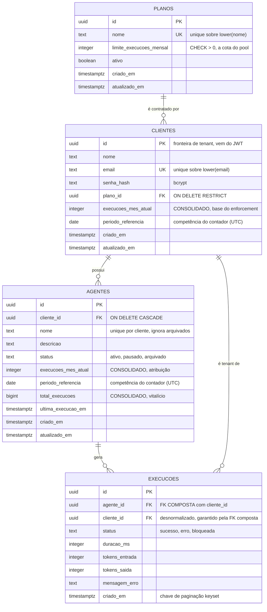

# rotik-panel-agents

**Painel de Monitoramento de Agentes de IA** · Desafio Técnico Fullstack · Rotik

MVP que permite ver, por cliente, quais agentes de IA estão ativos, quanto cada um consumiu da cota
mensal do plano contratado, e bloquear novas execuções quando o limite é atingido.

**Stack:** Node.js + TypeScript (backend) · React + TypeScript (frontend) · PostgreSQL
**Deploy:** [Frontend na Vercel](https://rotik-panel-agents.vercel.app) · [API na Render](https://rotik-agents-api-wendel211.onrender.com/health)

<details>
<summary><b>Por que essa stack</b></summary>

O desafio dá liberdade e cita Nuxt/Laravel como referência. Escolhi React + Node/TS, que também está
na stack da Rotik, por dois motivos: é onde produzo com mais densidade no tempo sugerido, e manter
TypeScript nas duas pontas deixa os contratos da API explícitos e alinhados entre backend e frontend.

PostgreSQL, e não MongoDB, porque o problema central aqui é **cota transacional**. A regra de negócio
depende de verificar um limite e incrementar um contador de forma atômica, que é o caso clássico de
transação ACID em linha única.
</details>

## Status

Construído **por etapas**, seguindo o enunciado. Cada etapa é revisada antes da seguinte começar, e é
por isso que o histórico de commits é granular.

| Etapa | Entrega | Status |
|---|---|---|
| **0** | **Discovery** | ✅ |
| **1** | **Modelagem de dados** | ✅ |
| **2** | **Backend REST API** | ✅ |
| **3** | **Frontend (SPA)** | ✅ |
| **4** | **Integração com a API real** | ✅ |
| **5** | **Qualidade, testes e debug** | ✅ |
| **6** | **DevOps (CI, deploy, env)** | ✅ |
| 7 | Mentalidade de produto | ⏳ |

**Convenção de commits:** [Conventional Commits 1.0.0](https://www.conventionalcommits.org/pt-br/v1.0.0/),
no formato `<tipo>(<escopo>): <descrição no imperativo>`.

## Índice

- [Etapa 0: Discovery](#etapa-0-discovery)
  - [Perguntas e suposições](#1-perguntas-que-eu-faria-ao-stakeholder)
  - [Entidades de negócio](#2-entidades-de-negócio)
  - [Escopo do MVP](#3-escopo-do-mvp)
  - [Riscos que decidi não resolver agora](#4-riscos-que-decidi-não-resolver-agora)
- [Etapa 1: Modelagem de dados](#etapa-1-modelagem-de-dados)
  - [Diagrama ER](#diagrama-er)
  - [Decisões de modelagem](#decisões-de-modelagem)
  - [Uso mensal sem COUNT(\*)](#uso-mensal-sem-count)
  - [Verificação empírica](#verificação-empírica)
- [Etapa 2: Backend REST API](#etapa-2-backend-rest-api)
  - [Endpoints](#endpoints)
  - [Decisões de arquitetura](#decisões-de-arquitetura)
  - [Rodando localmente](#rodando-localmente)
- [Etapas 3 e 4: Frontend e integração](#etapas-3-e-4-frontend-e-integração)
  - [Arquitetura de estado](#arquitetura-de-estado)
  - [Cota do cliente e atribuição por agente](#cota-do-cliente-e-atribuição-por-agente)
  - [Erros e estados da interface](#erros-e-estados-da-interface)
  - [Acessibilidade, responsividade e performance](#acessibilidade-responsividade-e-performance)
  - [Rodando o frontend](#rodando-o-frontend)
- [Etapa 5: Qualidade, testes e debug](#etapa-5-qualidade-testes-e-debug)
  - [Estratégia e cobertura](#estratégia-e-cobertura)
  - [Concorrência com Postgres real](#concorrência-com-postgres-real)
  - [Executando os testes](#executando-os-testes)
- [Etapa 6: DevOps e preparação para produção](#etapa-6-devops-e-preparação-para-produção)
  - [Variáveis de ambiente e secrets](#variáveis-de-ambiente-e-secrets)
  - [Execução local completa](#execução-local-completa)
  - [Integração contínua](#integração-contínua)
  - [Logs](#logs)
  - [Monitoramento em produção](#monitoramento-em-produção)
  - [Preparação para deploy](#preparação-para-deploy)

---

# Etapa 0: Discovery

O briefing tem uma frase que decide o projeto inteiro:

> "Quando o cliente estourar o limite, o agente deveria parar de responder **(ou pelo menos a gente
> precisa saber que isso aconteceu)**."

Esse parêntese não é detalhe de redação. É o time de Produto admitindo que não sabe se está pedindo um
**mecanismo de enforcement** ou um **painel de observabilidade**. São produtos diferentes, com donos,
riscos e custos diferentes. Quase todas as perguntas abaixo saem dessa dúvida, e boa parte do meu
Discovery foi decidir como não apostar tudo em uma das duas leituras.

## 1. Perguntas que eu faria ao stakeholder

São seis, e o mínimo pedido é cinco. Todas estão aqui porque a resposta mudaria código. Para cada uma
anoto também o custo de ter errado, porque é isso que decide quanto vale discutir antes de construir e
quanto vale apenas seguir com confiança.

### 1. O limite é do cliente ou de cada agente?

O briefing diz as duas coisas. "Cada **plano** tem um limite mensal" e "quando o **cliente** estourar o
limite" apontam para o cliente. Já "quantas execuções cada **agente** fez" aponta para o agente.

**Assumi que a cota é do cliente e a atribuição é do agente.** O plano é contratado pelo cliente, então
o limite é um pool compartilhado entre os agentes dele e o bloqueio olha o contador do cliente. Junto
disso mantenho um contador por agente, porque quando o CS vê uma conta em 95% a primeira pergunta nunca
é "quanto o cliente usou", e sim "qual agente está queimando isso".

<details>
<summary>Como isso concilia as duas leituras, e o custo se eu errei</summary>

O dashboard mostra a cota do cliente, que é a que bloqueia, e dentro de cada agente quanto aquele
agente consumiu do mesmo limite. Um agente em 60/100 ao lado de outro em 22/100 é lido na hora como
"o primeiro é o problema".

Se o limite for mesmo por agente, bastaria movê-lo para o agente ou criar uma tabela de override. O
contador por agente já existe no modelo, então a migração seria aditiva e o enforcement mudaria de
linha. **Custo baixo, e isso foi de propósito.**
</details>

### 2. Quem usa o painel: o CS da Rotik ou o cliente final?

De novo, o briefing diz os dois. "Fácil de usar pelo nosso time de CS" sugere ferramenta interna, mas a
Etapa 2 pede que "um cliente não pode ver dados de outro", que é self-service.

**Assumi tenant-scoped:** a autenticação é por cliente, o token carrega o identificador dele, e toda
query é filtrada por ele. O painel de CS vem depois, como um papel `admin` capaz de assumir a visão de
um tenant.

<details>
<summary>Por que nessa ordem, e o custo se eu errei</summary>

Isolamento é a decisão irreversível. Construir tenant-scoped e depois abrir para um admin é aditivo,
basta um claim de papel no token. Construir aberto e depois tentar apertar o isolamento é uma auditoria
de vazamento em cada endpoint. Quando não dá para perguntar, escolho o caminho que erra para o lado
seguro.

Se eu errei, o CS precisa trocar de login para ver cada conta. Chato, mas o painel funciona.
**Custo baixo.** O erro inverso teria sido vazamento de dados entre clientes.
</details>

### 3. A Rotik executa o agente, ou só registra que ele executou?

Essa é o parêntese do briefing traduzido em pergunta técnica. Se a Rotik está no caminho da requisição,
a recusa deste serviço **é** o "parar de responder". Se ela só recebe logs depois, bloquear aqui não
para nada, é só um carimbo, e o produto real passa a ser o alerta.

**Assumi que a Rotik executa.** A própria descrição diz "plataforma que permite criar, configurar e
monitorar agentes", e quem configura, executa. Logo este serviço é o sistema de registro da cota: o
runtime registra a execução antes de responder ao usuário final, e uma recusa faz o agente parar.

<details>
<summary>A consequência que assumo junto, e o custo se eu errei</summary>

Esse endpoint entra no caminho crítico de latência de **todo** atendimento da Rotik. É por isso que
trato performance de leitura como requisito da Etapa 1, e não como otimização prematura.

Se eu errei, a recusa vira sinalização e as execuções bloqueadas viram o produto. O código não muda, o
que muda é o que o consumidor faz com a resposta. **Custo baixo**, e é exatamente por isso que **registro
a execução bloqueada mesmo bloqueando**. Uma tentativa recusada e gravada atende às duas leituras do
parêntese ao mesmo tempo, sem me obrigar a escolher uma.
</details>

### 4. O que conta como uma execução?

Isso é semântica de faturamento. Se erro conta, o cliente paga por falha da Rotik. Se não conta, um
agente quebrado vira compute infinito de graça.

| Situação | Consome cota? | Por quê |
|---|---|---|
| Sucesso | **Sim** | Óbvio. |
| Erro (ex.: timeout do LLM) | **Sim** | O custo de inferência já foi pago pela Rotik. Não cobrar transforma agente instável em prejuízo. |
| **Bloqueada** por limite | **Não** | Nunca chegou a rodar. Cobrar por uma recusa seria indefensável, e criaria o absurdo de a cota estourada se auto-alimentar. |
| Retry | **Sim**, cada tentativa | O modelo não distingue retry de chamada nova. |

<details>
<summary>O custo se eu errei</summary>

Mudar para "erro não conta" é uma linha de código, mas **corrige o histórico para trás com
dificuldade**, porque competências já fechadas ficariam inconsistentes. **Custo médio**, e é a suposição
desta lista que eu mais gostaria de confirmar antes de faturar em cima dela.
</details>

### 5. "Mensal" é mês calendário ou ciclo da assinatura?

Um cliente que assinou dia 22 espera que a cota vire dia 22, não dia 1º. Errar isso gera ticket de
suporte e disputa de fatura.

**Assumi mês calendário, ancorado em UTC.** É o que "limite mensal" significa em linguagem natural e
basta para o MVP. Ancoro em UTC de propósito, porque a virada precisa ser determinística: sem uma
âncora única ela aconteceria em horários diferentes conforme o fuso de quem consulta, e um cliente
poderia consumir duas cotas na fronteira.

<details>
<summary>O custo assumido e o custo se eu errei</summary>

Custo assumido: para um cliente em São Paulo, a cota vira às 21h do último dia do mês.

Se for ciclo por aniversário, seria preciso trocar a competência por uma janela `(início, fim)`
derivada da data de assinatura e reescrever a lógica de virada. **Custo médio-alto, é a suposição
estruturalmente mais cara desta lista.** Aceito porque a alternativa é modelar um ciclo de billing
completo, com proração e upgrade no meio do ciclo, que está claramente fora do MVP.
</details>

### 6. O bloqueio é hard ou existe overage?

Um bloqueio hard derruba o atendimento do cliente em produção. Nenhuma empresa corta o serviço do maior
cliente às 3h da manhã sem uma decisão comercial consciente.

**Assumi hard block, sem overage**, porque o briefing é literal: "o agente deveria parar de responder".
Toda execução recusada fica registrada, o que dá ao Comercial a lista exata de **demanda reprimida**,
ou seja, quanto o cliente teria consumido. Isso é gatilho de upsell com evidência, e é receita que hoje
se perde em silêncio.

<details>
<summary>O custo se eu errei</summary>

Overage é aditivo: um limite hard opcional no plano, ou um campo de tolerância. E os dados para tomar
essa decisão **já estarão sendo coletados** nas execuções bloqueadas. **Custo baixo.**
</details>

## 2. Entidades de negócio

| Entidade | O que é | Vira tabela? |
|---|---|---|
| **Cliente** | Empresa contratante. É a fronteira de tenant e a titular da cota. | ✅ |
| **Plano** | Catálogo comercial. Carrega o limite mensal. | ✅ |
| **Agente** | Agente de IA de um cliente. Unidade de atribuição de consumo. | ✅ |
| **Execução** | Uma chamada ao agente. Tabela de fatos, append-only. | ✅ |
| **Limite** | Citado no briefing como conceito. | ❌ atributo de Plano |
| **Competência** | A janela contra a qual a cota é medida. | ❌ atributo |
| **Bloqueio** | O evento "execução recusada por limite". | ❌ estado de Execução |

As quatro primeiras são diretas. As três decisões de **não** criar tabela são as que valem discussão,
porque modelar demais custa tanto quanto modelar de menos.

<details>
<summary>Por que Limite, Competência e Bloqueio não viraram tabelas</summary>

**Limite é atributo de Plano.** O briefing diz "cada plano tem um limite mensal", ou seja,
cardinalidade 1:1. Uma entidade própria só se justificaria com múltiplos limites por plano (execuções
e tokens e agentes), que é a evolução mais provável deste modelo. Não construo agora porque é YAGNI, e
promover um atributo a tabela depois é uma migração mecânica.

**Competência não é entidade.** A tentação é criar `uso_mensal (cliente, mês, total)`, uma linha por
cliente por mês, que daria histórico de consumo de graça. Rejeitei para o MVP porque o briefing pergunta
"quantas execuções **este mês**" e nunca "compare com o mês passado". Uma linha por mês exigiria um
upsert no caminho crítico e ainda deixaria "qual é o mês atual?" para o código resolver. Guardar a
competência junto do contador responde a pergunta do briefing com uma única leitura. Quando histórico
entrar no escopo, as execuções já contêm os fatos para reconstruir o passado.

**Bloqueio é estado de Execução.** Uma tentativa recusada **é** uma tentativa de execução: tem agente,
cliente e timestamp, igual às outras. Uma tabela separada duplicaria a estrutura e forçaria unir duas
tabelas para responder "o que aconteceu com este agente hoje?", que é literalmente a pergunta que o CS
faz.
</details>

## 3. Escopo do MVP

### Dentro

| Item | Por quê |
|---|---|
| Cadastro e listagem de agentes | Pedido explícito. |
| Registro de execução com **enforcement atômico de cota** | É a regra central. Todo o resto é acessório. |
| Bloqueio com status HTTP adequado, e a tentativa recusada registrada | Atende às duas leituras do parêntese de uma vez. |
| Histórico de execuções paginado | Pedido explícito. É como o CS diagnostica. |
| Auth simplificada e isolamento por cliente | Sem isso, um painel de CS é um vazamento de dados. |
| Dashboard com % de consumo e indicação visual de bloqueio | É a tela que resolve a dor do briefing. |
| Estados de loading, vazio e erro | O briefing pede "fácil de usar". Tela branca sob falha não é. |
| Testes da regra de bloqueio | É a única regra cuja falha custa dinheiro direto. |
| Log estruturado no bloqueio | Pedido explícito, e é o evento que o negócio audita. |
| CI com lint e testes | Pedido explícito. |

### Fora

| Item | Por que fica fora |
|---|---|
| Runtime do agente de IA | O desafio é o painel. A execução é simulada pelo endpoint de registro. |
| Cobrança, overage, proração | Depende da pergunta 5. Modelar billing sem definir o ciclo é construir a coisa errada com precisão. |
| **Alertas ativos (e-mail/Slack em 80%)** | Provavelmente o item de **maior valor real**, já que o briefing diz "ser **alertados**" e alerta é push, não tela. Fica fora por falta de definição de canal, destinatário e deduplicação, não por falta de valor. O MVP entrega o threshold visual. |
| Painel multi-tenant de CS | Ver pergunta 2. Aditivo depois, e a ordem inversa seria insegura. |
| Gestão de planos pela UI | Planos mudam raramente e são decisão comercial. Seed resolve. |
| Conversão de tokens em R$ | O dado é capturado para não se perder, mas precificação não foi especificada. |
| Retenção e particionamento do histórico | Só importa em outra ordem de grandeza. Ver riscos. |
| Refresh token, RBAC, OAuth | O desafio dispensa: "uma simplificação documentada é aceitável". |

## 4. Riscos que decidi não resolver agora

Não são itens esquecidos, são decisões conscientes de adiar. Para cada um, o que me deixa confortável
em seguir sem resolver.

**O painel pode não ser o produto certo.** O briefing pede "ser alertados", e alerta não é tela, é
notificação. Existe risco real de construir um dashboard que ninguém abre. Sigo porque é o desafio
proposto e porque o dashboard é pré-requisito honesto do alerta, já que todo alerta precisa de um
destino para onde apontar. Mas trato isso de frente na Etapa 7, e as métricas que vou propor são
desenhadas para **detectar** esse fracasso em vez de escondê-lo.

**O contador consolidado pode divergir dos fatos.** Manter um contador em vez de contar as execuções na
hora é o que torna a leitura barata, mas cria a chance de o contador mentir, e ele é a base do
faturamento. Sigo porque contador e execução são escritos na **mesma transação**, então o banco já
garante o invariante no caminho normal. O que falta é defesa contra bug de código, não contra falha de
infra. E como as execuções continuam registradas, a verdade é sempre reconstruível: um job de
reconciliação comparando contagem real com o contador fecha o risco depois, rodando fora do caminho
crítico.

**O histórico de execuções cresce sem limite.** É a tabela que mais cresce e nada a contém. Sigo porque
a decisão de particionar depende de volume real, que não temos, e particionar cedo é complexidade sem
retorno. O modelo não bloqueia essa evolução: a leitura de cota **não depende** do histórico, então dá
para particionar, arquivar ou expurgar sem tocar no dashboard nem no enforcement.

**Concorrência entre registrar execução e mudar de plano.** Se o Comercial faz upgrade no exato momento
de um bloqueio, o resultado depende de quem commita primeiro. Sigo porque nunca há estado corrompido:
no pior caso uma execução é recusada milissegundos antes de um upgrade que a teria permitido, e o
runtime já trata recusa com retry. Impacto real perto de zero.

**Não há RLS no banco.** O isolamento entre clientes depende de a aplicação sempre filtrar por cliente.
A FK composta protege a **escrita** (ver Etapa 1), mas não faz nada por um `SELECT` que esqueça o
filtro. Sigo porque o Postgres nunca é exposto direto ao usuário final nesta arquitetura, então a
superfície é só o nosso próprio código. Fica registrado porque é uma dívida real: se um dia a base for
exposta via PostgREST ou similar, RLS deixa de ser opcional.

---

# Etapa 1: Modelagem de dados

Fonte da verdade: [`db/init/01_schema.sql`](db/init/01_schema.sql)
SQL comentado da regra central: [`db/queries/registrar_execucao.sql`](db/queries/registrar_execucao.sql)

## Diagrama ER

Versão navegável e pública: [modelo ER no dbdiagram.io](https://dbdiagram.io/d/modeloER-6a56e578067336e1de76f9d3).



<details>
<summary><b>Versão gerada no dbdiagram.io</b> (mesmo modelo, layout visual)</summary>


Fonte em [`db/er.dbml`](db/er.dbml). Para editar, cole o conteúdo em <https://dbdiagram.io/d>.

> O `01_schema.sql` é a fonte da verdade. O Mermaid acima e o DBML são representações derivadas e
> precisam ser regerados quando o schema mudar.
</details>

## Decisões de modelagem

### Normalização, e as três exceções deliberadas

O modelo está em 3FN, com três desnormalizações conscientes:

| Desnormalização | O que compra | O que custa |
|---|---|---|
| `clientes.execucoes_mes_atual` | Leitura de cota em O(1) em vez de `COUNT(*)` | Precisa ser mantido em transação |
| `agentes.execucoes_mes_atual` e `total_execucoes` | Atribuição por agente e total da paginação sem `COUNT(*)` | Idem |
| `execucoes.cliente_id` | Isolamento de tenant e índice sem JOIN | Poderia divergir de `agentes.cliente_id`, mas não pode (abaixo) |

**A terceira não custa nada, e isso é de propósito.** `execucoes.cliente_id` é derivável via `agentes`,
mas é **imutável**, porque uma execução nunca troca de dono. Não existe `UPDATE` que possa fazê-la
divergir. Falta só impedir que ela nasça errada, e quem impede é o banco:

```sql
CONSTRAINT execucoes_agente_fk FOREIGN KEY (agente_id, cliente_id)
  REFERENCES agentes (id, cliente_id) ON DELETE CASCADE
```

Essa FK composta, viabilizada pelo `UNIQUE (id, cliente_id)` em `agentes`, torna **fisicamente
impossível** gravar uma execução do agente do cliente A sob o cliente B. Em multi-tenant, esse tipo de
invariante não deveria depender de o desenvolvedor lembrar de escrever o `WHERE` certo.

<details>
<summary>Relacionamentos, tipos e a política de exclusão</summary>

**Relacionamentos**

- `planos → clientes` é `ON DELETE RESTRICT`. Apagar um plano com clientes ativos deve doer, não
  cascatear.
- `clientes → agentes → execucoes` é `ON DELETE CASCADE`. Off-boarding de cliente remove tudo em um
  comando, o que ajuda em LGPD.

**Política de exclusão de agente.** O CASCADE acima significa que apagar um agente apagaria o histórico
dele, inclusive as linhas `bloqueada` que são auditoria. Isso conflitaria com o "precisamos saber que
isso aconteceu" do briefing. A saída **não** é trocar por `RESTRICT`, porque isso quebraria a cadeia de
off-boarding do cliente: a exclusão do cliente falharia ao esbarrar nas execuções. A proteção vem de
uma regra de aplicação: **agente nunca é apagado, é arquivado**. A única remoção legítima é a do
cliente inteiro saindo da base.

**`status` como `text` + `CHECK`, e não `ENUM`.** `ENUM` nativo dá 4 bytes e type safety, mas
`ALTER TYPE ... ADD VALUE` tem restrições transacionais desagradáveis em migração. Um domínio que ainda
vai mudar (`pausado` e `arquivado` são suposições minhas) evolui melhor como `CHECK`, que é só um
`ALTER TABLE`. Troca consciente de performance marginal por evolvabilidade.
</details>

### Índices

Cada índice existe para uma query nomeada, não por precaução:

| Índice | Query que ele serve |
|---|---|
| `execucoes (agente_id, criado_em DESC, id DESC)` | Histórico paginado por keyset, a query mais quente |
| `execucoes (cliente_id, criado_em DESC, id DESC)` | Últimas execuções da conta, para diagnóstico do CS |
| `execucoes (cliente_id, criado_em DESC) WHERE status='bloqueada'` | **Parcial.** Bloqueios são menos de 1% das linhas mas são o que o CS caça. Índice pequeno e barato |
| `agentes (cliente_id, criado_em DESC)` | Dashboard |
| `agentes (cliente_id, lower(nome)) WHERE status<>'arquivado'` | **Único parcial.** Nome único por cliente, mas libera o nome ao arquivar |
| `clientes (lower(email))`, `planos (lower(nome))` | **Únicos.** Comparação case-insensitive |

**Por que `id` entra na chave do keyset:** `criado_em` não é único. Duas execuções no mesmo
milissegundo tornariam a ordenação instável e uma linha poderia ser pulada ou repetida entre páginas.
`(criado_em, id)` é uma chave total.

**Índice que deliberadamente não criei:** nenhum sobre `execucoes.status` sozinho. São 3 valores, e com
cardinalidade tão baixa o planner ignoraria. O caso que importa já está coberto pelo índice parcial.

## Uso mensal sem COUNT(*)

Este é o requisito crítico de performance do desafio.

### O problema com COUNT(*) em tempo real

O caminho ingênuo seria:

```sql
-- Nunca no código deste projeto
SELECT COUNT(*) FROM execucoes
 WHERE cliente_id = $1 AND criado_em >= date_trunc('month', now());
```

Isso funciona no seed e falha em produção, por três motivos:

1. **Custo O(n) no sucesso do cliente.** Postgres não tem contagem O(1). Mesmo com índice é preciso
   varrer as entradas do mês e checar visibilidade, porque o MVCC não guarda contagem no índice. O
   cliente com 500 mil execuções por mês tem o dashboard mais lento, ou seja, **o cliente que mais paga
   tem a pior experiência**. A performance degrada exatamente na direção em que o negócio cresce.
2. **Roda no caminho crítico.** Pela suposição 3, a checagem de cota acontece antes de cada resposta de
   agente. Uma varredura por atendimento é latência direta no produto.
3. **Não resolve a corrida**, que é o problema mais sério e o que costuma passar batido.

### A solução: contador consolidado com reset preguiçoso

**Consolidação.** O contador vive na linha do cliente e é atualizado na mesma transação que grava a
execução. Ler a cota vira uma leitura por chave primária: O(1), constante, indiferente ao volume.

**Reset preguiçoso, sem cron.** O par `(execucoes_mes_atual, periodo_referencia)` é lido como: o
contador vale `execucoes_mes_atual` **se** `periodo_referencia` for a competência atual, senão vale 0.

Isso elimina o job de virada de mês, que precisaria acordar à meia-noite UTC, tocar todas as linhas e
ainda seria um ponto de falha silencioso, porque se não rodasse todo mundo continuaria bloqueado. O
reset acontece sozinho, por cliente, na primeira execução do mês.

O preço é que **quem lê também precisa aplicar a regra**, senão um cliente inativo em julho apareceria
em agosto ainda exibindo o consumo de julho. Por isso ela está encapsulada na view `vw_agentes_consumo`
em vez de repetida em cada query.

### A parte que realmente importa: a corrida

Um contador consolidado não basta. Este código está errado:

```ts
// check-then-act, bug de concorrência clássico
const { usado, limite } = await getConsumo(clienteId);
if (usado >= limite) return res.status(429).json(...);
await registrarExecucao(...);   // outro request pode ter entrado aqui
```

Dois requests concorrentes leem `99/100`, ambos concluem que tem espaço, ambos incrementam, e o
resultado é `101/100`. A cota vaza **exatamente sob a carga em que o limite mais importa**, e um teste
sequencial nunca pega isso.

A correção é fazer a verificação e o incremento serem a **mesma operação**, colocando o limite no
`WHERE` do próprio `UPDATE`:

```sql
UPDATE clientes c
   SET execucoes_mes_atual =
         CASE WHEN c.periodo_referencia = periodo_atual()
              THEN c.execucoes_mes_atual + 1
              ELSE 1                      -- reset preguiçoso
         END,
       periodo_referencia = periodo_atual()
  FROM planos p
 WHERE c.id = $1
   AND c.plano_id = p.id
   AND (CASE WHEN c.periodo_referencia = periodo_atual()
             THEN c.execucoes_mes_atual
             ELSE 0
        END) < p.limite_execucoes_mensal   -- o limite, dentro do WHERE
RETURNING c.execucoes_mes_atual AS usado, p.limite_execucoes_mensal AS limite;
```

O Postgres pega um row lock na linha do cliente e reavalia o `WHERE` contra a versão já commitada
(EvalPlanQual), serializando os concorrentes. O segundo request enxerga `100/100`, o `WHERE` falha, e o
`UPDATE` afeta zero linhas. O resultado vira o contrato do endpoint, sem ambiguidade:

- **1 linha** significa cota consumida, grava a execução e responde `201`.
- **0 linhas** significa limite atingido, grava a execução como `bloqueada` e responde `429`.

Não precisa de `SERIALIZABLE`, nem de advisory lock, nem de retry. Uma declaração, uma linha, um lock.
**Este é o núcleo do desafio, e ele é resolvido no banco, não no TypeScript.**

<details>
<summary>Duas premissas que essa garantia carrega</summary>

1. **Vale por linha, e só se todo caminho de escrita passar por esse UPDATE.** Um script de correção
   manual, um import em massa ou um retry que reemita um incremento cru furam a proteção inteira.
2. **Depende de READ COMMITTED**, que é o default do Postgres. Sob REPEATABLE READ ou SERIALIZABLE o
   mesmo statement lançaria erro `40001` em vez de retornar 0 linhas. Continua correto, nada estoura a
   cota, mas o modo de falha muda e a aplicação passaria a precisar de retry. Se um pooler ou ORM
   alterar o isolamento padrão, a Etapa 2 quebra de forma silenciosa.
</details>

### O balanço da troca

| | `COUNT(*)` em tempo real | Contador consolidado |
|---|---|---|
| Leitura da cota | **O(execuções no mês)** | **O(1)** |
| Escrita | 1 `INSERT` | 1 `INSERT` + 2 `UPDATE`, mesma transação |
| Corrida sob concorrência | **Presente** | **Eliminada por construção** |
| Virada de mês | Automática | Reset preguiçoso |
| Risco | Nenhum de corretude | Contador pode divergir dos fatos |

Trocamos um custo **que cresce sem limite** por um custo **fixo**, e um risco de corretude por um risco
de consistência, que é observável e reconciliável porque as execuções seguem registradas.

Resultado: `GET /agents` inteiro, com consumo, limite, percentual e estado bloqueado de todos os
agentes, é **um index scan em `agentes` mais lookups por PK**. Zero `COUNT(*)`, zero `GROUP BY`, custo
independente do histórico do cliente.

## Verificação empírica

Afirmar que "o `UPDATE` condicional elimina a corrida" é fácil. Um argumento sobre concorrência que não
foi executado é só uma hipótese bem escrita. Rodei os dois padrões contra PostgreSQL 16 real, com 40
conexões concorrentes de verdade, contra o cliente do seed em `82/100`, ou seja, 18 vagas restantes:

| Padrão | Aceitos | Contador final | Cota vazou? |
|---|---|---|---|
| **`UPDATE` condicional** (implementado) | **18** ✅ | **100 / 100** | **Não** |
| `SELECT` → `if` → `UPDATE` (ingênuo) | 30 ❌ | **112 / 100** | **Sim, 12 execuções não faturadas** |

No caminho atômico os valores retornados pelo `RETURNING` foram exatamente `83, 84, ... 100`, cada um
uma única vez, sem nenhum lost update. As 22 tentativas excedentes receberam `UPDATE 0`, que é
precisamente o sinal de `429`.

O caminho ingênuo, sob a mesma carga, deixou passar 12 execuções além do limite. Em produção isso é
inferência que a Rotik paga ao provedor de LLM e não fatura. **Um teste sequencial passaria nos dois.**

Também verificado no mesmo ambiente:

- **Reset preguiçoso na leitura.** Cliente com `periodo_referencia = 2026-06-01` e contador `95` é lido
  pela view como `0` na competência de julho, sem cron e sem job de virada.
- **Reset preguiçoso na escrita.** A primeira execução do novo mês reinicia o contador em `1`.
- **Isolamento de tenant.** `INSERT` de uma execução do agente da Acme sob o `cliente_id` da Globex é
  recusado pelo banco com `violates foreign key constraint "execucoes_agente_fk"`.
- **Unicidade case-insensitive.** Inserir o plano `growth` com `Growth` já existente é recusado.

> Os testes automatizados da Etapa 5 formalizam esses cenários, inclusive o de concorrência, para que a
> regra não regrida em silêncio.

---

# Etapa 2: Backend REST API

Express 4 + TypeScript estrito + Zod, com `pg` puro. Código em [`backend/`](backend/).

## Endpoints

| Método | Rota | O que faz |
|---|---|---|
| `GET` | `/health` | Checa processo **e** banco. Uma API que não alcança o Postgres responde 503. |
| `POST` | `/auth/login` | E-mail e senha, devolve JWT. Auth simplificada, que o desafio permite. |
| `POST` | `/agents` | Cadastra agente no tenant do token. |
| `GET` | `/agents` | Lista agentes com consumo, limite, percentual e flag de bloqueio. |
| `POST` | `/agents/:id/executions` | **A regra central.** Consome cota atomicamente ou bloqueia com 429. |
| `GET` | `/agents/:id/executions` | Histórico paginado por keyset. |

Envelope de erro único em toda a API. O frontend ramifica por `codigo`, que é estável, e nunca pela
mensagem, que é texto humano e vai mudar:

```json
{ "erro": { "codigo": "LIMITE_PLANO_ATINGIDO", "mensagem": "...", "detalhes": { } } }
```

## Decisões de arquitetura

### `pg` puro, sem ORM

A regra central é um `UPDATE` condicional escrito à mão. Qualquer ORM obrigaria a cair em raw query
justamente nela, ou seja, pagaríamos o peso da dependência e ainda escreveríamos o SQL na mão no
único ponto que importa. Pior: esconderia atrás de abstração exatamente o que está sendo avaliado.
Ficou `pg` com uma camada fina de repositório.

### 429, e não 402 ou 403, no bloqueio

O desafio pede "o status adequado", e isso é julgamento. Cota mensal é conceitualmente um rate limit
(N chamadas por janela), e `429` é o que clientes HTTP e SDKs já sabem tratar, inclusive respeitando
`Retry-After`. Mando o `Retry-After` apontando para o início da próxima competência, que é quando a
cota realmente volta, então é informação verdadeira e acionável.

`402 Payment Required` seria defensável, já que é literalmente "faça upgrade", mas é raro o suficiente
para que a maioria dos consumidores não trate. Escolhi interoperabilidade em vez de pureza semântica.

### A transação commita mesmo quando bloqueia

Esse é o detalhe mais frágil do desenho e o mais fácil de errar. O `withTransaction` faz `ROLLBACK` em
qualquer exceção. Se o repositório lançasse o 429 de dentro da transação, a linha
`status='bloqueada'` seria revertida junto, e perderíamos exatamente o "pelo menos a gente precisa
saber que isso aconteceu" do briefing.

Por isso o repositório devolve uma união discriminada em vez de lançar, a transação commita nos dois
caminhos, e quem converte o bloqueio em 429 é a rota, depois do commit.

### 404, e não 403, para recurso de outro tenant

Um `403` confirmaria que o id existe. Isso já é vazamento de informação entre clientes: dá para
enumerar agentes da concorrência pela diferença entre 403 e 404. O agente de outro cliente
simplesmente não existe para você.

### Paginação keyset, e não OFFSET

`OFFSET 10000` obriga o Postgres a varrer e descartar 10 mil linhas antes de devolver a página, então
a página 500 custa 500 vezes a página 1. O keyset usa o índice
`execucoes (agente_id, criado_em DESC, id DESC)` para posicionar direto no corte, com custo igual em
qualquer profundidade.

A comparação é em tupla, `(criado_em, id) < (cursor)`, e não só por `criado_em`: o timestamp não é
único, e sem o id como desempate uma execução no mesmo milissegundo do corte seria pulada ou repetida
entre páginas.

O custo assumido: não dá para pular para a "página 7", só avançar. E não devolvo total de itens,
porque contar exigiria o `COUNT(*)` que o projeto inteiro evita. O total de execuções do agente já vem
consolidado no `GET /agents`, que é onde o CS precisa dele.

### Segurança

- `req.clienteId` só é escrito a partir do JWT verificado, **nunca** de body, query ou params. Se o
  tenant pudesse vir do request, bastaria o cliente A mandar o id do cliente B.
- O Zod faz strip de campos não declarados, o que mata mass assignment: um `POST /agents` com
  `cliente_id` no body tem o campo descartado antes de chegar ao SQL.
- `status: 'bloqueada'` não é aceito no input. É estado que só o servidor atribui, senão o cliente
  forjaria auditoria de bloqueio que nunca aconteceu.
- Erro não previsto vira 500 genérico e o detalhe fica só no log. Mensagem crua do Postgres vaza nome
  de tabela, coluna e constraint.
- O login compara bcrypt mesmo quando o e-mail não existe, contra um hash falso, para o tempo de
  resposta não revelar quais e-mails existem na base.

## Rodando localmente

```bash
# Execute a partir da raiz do repositório.
cp .env.example .env
cp backend/.env.example backend/.env
cp frontend/.env.example frontend/.env

# 1. Banco
docker compose up -d

# 2. API
cd backend
npm ci
npm run dev          # http://localhost:3333
```

No PowerShell, troque os três comandos `cp` por:

```powershell
Copy-Item .env.example .env
Copy-Item backend/.env.example backend/.env
Copy-Item frontend/.env.example frontend/.env
```

O `DATABASE_URL` de `backend/.env` precisa usar o mesmo usuário, senha, banco e porta definidos no
`.env` da raiz. Os valores versionados são exemplos exclusivos de desenvolvimento.

Credenciais de demo do seed: `cs@acme.dev` / `senha123` (plano Growth, abre em 82/100) e
`cs@globex.dev` / `senha123` (plano Scale, 140/1000). Os dois existem para testar o isolamento entre
clientes, e os consumos são propositalmente diferentes: uma conta em zona de alerta e uma folgada.

> O seed só roda em volume vazio. Se ele mudar, recrie o banco com
> `docker compose down -v && docker compose up -d` **e faça login de novo**: o `down -v` recria os
> UUIDs, e um token antigo aponta para um cliente que não existe mais.

```bash
# Fluxo completo
TOKEN=$(curl -s -X POST localhost:3333/auth/login -H 'Content-Type: application/json'   -d '{"email":"cs@acme.dev","senha":"senha123"}' | jq -r .token)

curl -s localhost:3333/agents -H "Authorization: Bearer $TOKEN" | jq
```

---

# Etapas 3 e 4: Frontend e integração

SPA em React 19, TypeScript estrito, Vite, Tailwind CSS, TanStack Query e Zod. O código está em
[`frontend/`](frontend/) e consome exclusivamente a API real da Etapa 2. Não há mocks estáticos.

A composição começa pela superfície de trabalho que o CS precisa operar: a cota compartilhada da conta,
os agentes ordenados abaixo dela e as ações de diagnóstico no contexto de cada agente. A interface usa o
azul da Rotik como único destaque de marca, reservando verde, amarelo e vermelho para significado de
estado.

## Design system e identidade visual

O frontend parte da identidade pública da Rotik, sem copiar a estrutura do site institucional. A paleta
foi transformada em tokens semânticos no Tailwind: azul-noite para navegação e superfícies de maior
hierarquia, azul elétrico para ações, azul-claro para foco e apoio, além de canvas, superfície, texto e
borda neutros. O logotipo oficial fica versionado como asset local e a tela de acesso usa a imagem pública
do produto como contexto visual, mantendo o painel funcional mesmo quando essa imagem externa não carrega.

Os controles compartilhados (`control-field`, `button-primary`, `button-secondary` e `icon-button`)
concentram foco, estados desabilitados, contraste, raio e transição. Isso evita que formulários, diálogos e
ações evoluam com estilos divergentes. O cabeçalho escuro ancora a marca, a cota é a única superfície de
alto contraste e os agentes usam uma lista operacional com colunas, em vez de uma grade de cards sem
hierarquia.

## Arquitetura de estado

Há três naturezas de estado e cada uma fica no lugar com o ciclo de vida adequado:

| Estado | Onde vive | Justificativa |
|---|---|---|
| Agentes, consumo e histórico | **TanStack Query** | São dados do servidor. A biblioteca controla cache, latência, invalidação e novas tentativas sem duplicar a fonte de verdade em uma store. |
| Sessão autenticada | **Contexto React + `localStorage`** | Token e cliente precisam ser lidos por qualquer chamada da aplicação. É o único estado realmente global. O armazenamento local é uma simplificação coerente com o JWT simples aceito pelo desafio; uma versão de produção usaria cookie `httpOnly` e refresh token. |
| Modal aberto, agente selecionado, formulário e avisos | **Estado local** | São estados efêmeros, pertencem a uma única árvore visual e não justificam uma store global. |

As fronteiras da API têm tipos explícitos em [`frontend/src/types/api.ts`](frontend/src/types/api.ts).
O cliente HTTP centraliza o header de autenticação, o envelope de erro e a falha de rede. Nenhuma tela
interpreta mensagens humanas para decidir comportamento.

## Cota do cliente e atribuição por agente

A decisão central do Discovery aparece diretamente na hierarquia visual:

1. Existe **uma única barra principal**, alimentada por `execucoesMesCliente`, `limiteMensal` e
   `percentualUsoCliente`. Ela representa o pool que bloqueia a conta inteira.
2. Cada linha de agente mostra `execucoesMesAgente`, a atribuição necessária para descobrir quem está
   consumindo a cota, em número absoluto. Não existe barra por agente porque o limite pertence ao cliente.
3. A indicação de bloqueio cruza dois campos. `bloqueado && status === 'ativo'` significa cota esgotada.
   `status === 'pausado'` e `status === 'arquivado'` recebem rótulos próprios e nunca são apresentados
   como bloqueio de plano.

O botão **Simular execução** é identificado como recurso de demonstração. O painel é de monitoramento,
mas o projeto não contém um runtime de IA. Sem essa ação, o avaliador não conseguiria observar o
enforcement central. Quando a cota já acabou, o botão muda para **Tentar execução** e permanece disponível
somente para agentes ativos, permitindo gerar a tentativa `bloqueada` que deve aparecer na auditoria.

## Erros e estados da interface

O frontend ramifica por `erro.codigo`, nunca por `erro.mensagem`:

- `AGENTE_JA_EXISTE` marca o campo `nome` no formulário.
- `DADOS_INVALIDOS` distribui a lista de detalhes nos campos correspondentes.
- `NAO_AUTENTICADO` e `TOKEN_EXPIRADO` encerram a sessão e retornam ao login.
- `LIMITE_PLANO_ATINGIDO` abre um diálogo dedicado com consumo, limite, liberação prevista e o efeito
  sobre todos os agentes. A tentativa bloqueada é invalidada no cache do histórico imediatamente.
- `AGENTE_INATIVO` e demais falhas previstas preservam a tela e mostram uma mensagem contextual.
- Falhas de rede têm um estado recuperável com ação para tentar novamente. Nenhum erro resulta em tela
  branca.

O histórico usa `useInfiniteQuery` e devolve ao backend o cursor opaco. A interface oferece apenas
**Carregar mais** enquanto `proximoCursor` existir. Não há total de itens, páginas numeradas ou `OFFSET`
inventado no cliente.

Loading do dashboard e do histórico usa skeletons explícitos. A lista vazia orienta o cadastro do
primeiro agente. Mutações mostram progresso no próprio botão para evitar duplo envio. A atualização
manual troca o rótulo para **Atualizando...**, anuncia o estado para tecnologias assistivas e confirma o
resultado; uma falha de refetch mantém os dados anteriores visíveis em vez de desmontar o painel.

## Acessibilidade, responsividade e performance

- HTML semântico com cabeçalhos em ordem, listas, labels, `time` e `progressbar` com valores acessíveis.
- Foco visível em toda a aplicação e alvos de toque adequados.
- Diálogos nativos com retenção de foco, fechamento por `Escape` e devolução do foco ao acionador.
- Avisos com regiões `status` ou `alert`, conforme a urgência.
- Layout verificado em 1440 x 900 e 390 x 844, com ações e métricas reorganizadas sem rolagem horizontal.
- `prefers-reduced-motion` desativa animações para quem solicita movimento reduzido.
- `AgentRow` é memoizado. Dados do servidor usam cache e invalidação pontual, e a paginação limita o
  histórico a 20 itens por request.

## Decisões de design

O produto da Rotik é escuro, e o painel operacional é uma **tela de vigília**: o CS deixa aberta o dia
inteiro. Isso decidiu quase tudo abaixo.

### Rail em vez de header

Um header cheio gasta a faixa horizontal mais valiosa da tela, onde o olho entra, com identidade e
conta, que é justamente o que o operador menos consulta. O rail move navegação e identidade para o
eixo vertical, que sobra, e devolve o topo para o que importa: onde estou e o que posso fazer aqui.
No mobile ele vira barra inferior, porque navegação lateral em tela estreita rouba largura que o
conteúdo não tem para dar.

Sair vive dentro do menu do avatar, não como botão solto: é ação rara e destrutiva de sessão, então
não merece alvo permanente ao lado das ações do dia a dia, onde é clicada por engano.

### Não existe barra de progresso por agente

Essa é a decisão de UI mais importante, e ela vem direto da [suposição central](#1-o-limite-é-do-cliente-ou-de-cada-agente):
a cota é do **cliente**. Uma barra por agente repetiria o mesmo percentual em todas as linhas e leria
como bug. A cota compartilhada tem **uma** barra, em destaque, e a atribuição por agente aparece em
número absoluto na lista, que é o que responde "qual agente está queimando isso".

O card diz em texto que a cota é compartilhada e que o bloqueio derruba todos os agentes juntos. Sem
isso, o operador concluiria que só o agente que está olhando parou.

### Estado na borda inteira, nunca só na cor

Cada linha de agente é envolvida por uma borda da cor do estado: verde ativo, amarelo pausado,
vermelho bloqueado. Antes era uma faixa fina na aresta esquerda, e o sinal ficava pequeno demais para
ser lido na periferia enquanto o olho varre nomes à esquerda e ações à direita.

A borda é **reforço redundante**, não o portador do significado: o selo textual continua lá, porque
cor sozinha não pode carregar informação ([WCAG 1.4.1](https://www.w3.org/WAI/WCAG22/Understanding/use-of-color)).

### `bloqueado` tem duas causas, e a UI separa

A API devolve `bloqueado: true` quando a cota do cliente esgotou **ou** quando o agente não está
`ativo`. Tratar os dois como o mesmo estado mentiria: um exige decisão comercial (upgrade de plano),
o outro é um agente desligado de propósito. A UI distingue em rótulo e cor.

### Tema escuro por padrão, claro por escolha

O escuro vive no `@theme` e o claro é um override em `:root[data-theme='light']`, então sem atributo
a página **nasce escura** e não há flash no primeiro paint (um script inline no `<head>` aplica a
preferência salva antes do React montar).

De propósito **não** seguimos `prefers-color-scheme`: o painel da Rotik é escuro, e herdar o tema do
sistema jogaria a maioria numa versão que não é a identidade do produto.

<details>
<summary>Duas armadilhas que isso escondia</summary>

**`@apply` de utilitário de cor não sobrevive ao tema.** Ele resolve o token para o valor literal em
tempo de build, e o CSS sai com `background-color: #16223a` em vez de `var(--color-panel-2)`. O
override do tema não tem o que sobrescrever. Quebrava de forma assimétrica e silenciosa: uns
componentes viravam, outros não. As cores dependentes de tema usam `var()` explícito.

**`--color-accent` existe para não quebrar o login.** O painel esquerdo do login é sempre escuro e usa
`brand-300`; sobrescrever aquele token no tema claro apagaria o texto dele. O accent flipa, o brand
não.
</details>

### Cor semântica escolhida por matiz e contraste

Pausado é **amarelo** (48deg no escuro, 46deg no claro) e bloqueado é **vermelho** (0deg nos dois).
Antes eram âmbar e rose: âmbar puxa laranja e chegava perto do vermelho, justo o estado vizinho que
não pode ser confundido, e rose puxa rosa e não lia como alarme. Os quatro passam 4.5:1.

No tema claro, os cards permanecem neutros. Verde, amarelo e vermelho aparecem em bordas, monogramas e
selos com fundos semânticos suaves; assim o estado continua reconhecível sem criar manchas saturadas por
trás de nome, consumo e ações. Texto e ícones usam tons mais profundos para manter contraste AA.

### Tipografia

**Inter** para UI e **JetBrains Mono** para números, self-hosted via npm em vez de Google Fonts: sem
request a terceiro no caminho crítico, funciona offline e não vaza IP do usuário.

Mono nos números não é enfeite. Este painel é sobre **contagem**, e dígito de largura fixa faz as
colunas alinharem e o valor parar de dançar ao atualizar. Pelo mesmo motivo `tnum` fica ligado no
Inter, junto de `cv11` e `ss01`, que melhoram a legibilidade em corpo pequeno.

### Movimento com orçamento

Toda animação de atenção é **finita** (3 e 4 repetições, não `infinite`). Numa tela que fica aberta o
dia todo, animação infinita manteria o compositor acordado para sempre queimando GPU e bateria, e
depois dos primeiros segundos já não chama atenção: vira ruído. As barras animam `transform`, não
`width`, para a transição ficar no compositor.


## Rodando o frontend

Com o banco e a API já iniciados conforme a Etapa 2:

```bash
cd frontend
npm ci
npm run dev          # http://localhost:5173
```

`VITE_API_URL` define a origem da API e vale `http://localhost:3333` no ambiente local. As credenciais
de demonstração continuam sendo `cs@acme.dev` / `senha123` e `cs@globex.dev` / `senha123`.

Verificações disponíveis nesta etapa:

```bash
cd frontend
npm run typecheck
npm run lint
npm run build
```

---

# Etapa 5: Qualidade, testes e debug

## Estratégia e cobertura

Os testes foram organizados pela fronteira que precisam provar, e não por uma meta artificial de linhas:

- **Backend:** integração HTTP contra Postgres real para autenticação, isolamento entre tenants, cadastro,
  validação, reset mensal preguiçoso, histórico keyset, bloqueio e auditoria; middlewares de fronteira têm
  testes unitários para os caminhos que não dependem de I/O.
- **Frontend:** comportamento observado pelo usuário com Vitest, Testing Library e JSDOM. A suíte cobre
  login, sessão expirada, cliente HTTP, tema, formulários, diálogos, estados vazio/loading/erro, paginação,
  simulação e feedback de limite.
- **Quality gate:** statements, branches, functions e lines precisam ficar em **90% ou mais** nos dois
  projetos. O comando termina com erro se qualquer uma das quatro métricas cair abaixo desse piso.

Resultado local desta etapa:

| Projeto | Testes | Statements | Branches | Functions | Lines |
|---|---:|---:|---:|---:|---:|
| Backend | 12 | 97,35% | 92,85% | 95,23% | 97,25% |
| Frontend | 29 | 97,93% | 92,08% | 99,19% | 99,41% |

Arquivos de bootstrap, declarações de tipo, componentes puramente estáticos e o logger são excluídos da
instrumentação. Eles continuam cobertos por typecheck/build; a exclusão evita fingir valor com testes que
apenas importariam wiring sem comportamento.

## Concorrência com Postgres real

O teste central não usa mock do repositório nem banco em memória. O setup cria um banco `rotik_test`
isolado, aplica o schema real e dispara **112 requests HTTP concorrentes** para uma conta cujo limite é
100. O invariante esperado e verificado é:

- 100 respostas `201`, 100 execuções cobradas e contador consolidado exatamente em 100;
- 12 respostas `429`, 12 tentativas `bloqueada` preservadas para auditoria;
- nenhum incremento além da cota e nenhuma divergência entre contador e fatos.

Esse cenário é o motivo de a Etapa 5 trazer parte da Etapa 6: sem um Postgres de verdade no CI, o risco
financeiro mais importante do projeto seria testado apenas na máquina de quem desenvolveu.

## Executando os testes

O container `rotik-db` precisa estar ativo para a suíte do backend. O setup usa `rotik_test` e nunca limpa
o banco de desenvolvimento `rotik`.

```bash
# na raiz
docker compose up -d

# backend: integração real + cobertura
cd backend
npm ci
npm run test:coverage

# frontend: comportamento + cobertura
cd ../frontend
npm ci
npm run test:coverage
```

Para uma verificação equivalente ao CI, execute também `lint`, `typecheck` e `build` nos dois projetos.

---

# Etapa 6: DevOps e preparação para produção

A aplicação está publicada com o frontend estático na Vercel e a API Docker na Render, conectada a um
PostgreSQL gerenciado pela própria Render. O frontend fala somente com a URL HTTPS da API; o backend
restringe o CORS ao domínio público da Vercel e o banco aceita apenas conexões pela rede privada.

## Variáveis de ambiente e secrets

Nenhuma credencial de runtime está escrita no código ou nos manifestos. Arquivos `.env` são ignorados
pelo Git; apenas modelos documentados entram no repositório. Na Render, `JWT_SECRET` é gerado pelo
provedor e `DATABASE_URL` é referenciada diretamente do banco, sem expor seus valores no Blueprint.

| Variável | Serviço | Sensível? | Função |
|---|---|---:|---|
| `DATABASE_URL` | Backend | **Sim** | Conexão completa com o PostgreSQL gerenciado. |
| `DATABASE_SSL` | Backend | Não | Override de TLS (`true`/`false`); por padrão fica ativo em produção. |
| `JWT_SECRET` | Backend | **Sim** | Assinatura dos tokens; mínimo de 32 caracteres e valor aleatório por ambiente. |
| `JWT_EXPIRES_IN` | Backend | Não | Duração da sessão simplificada. |
| `CORS_ORIGIN` | Backend | Não | Origens permitidas, separadas por vírgula. Deve conter o domínio real do frontend. |
| `LOG_LEVEL` | Backend | Não | Verbosidade do Pino; `info` é o padrão recomendado em produção. |
| `PORT` | Backend | Não | Porta HTTP; pode ser injetada pela plataforma. |
| `VITE_API_URL` | Frontend | Não | URL pública da API, incorporada ao bundle durante o build. |
| `POSTGRES_*` | Compose local | Sim, senha | Inicialização exclusiva do banco local. Não é usado no deploy gerenciado. |
| `ALLOW_DEMO_SEED` | Operação de banco | Não | Trava explícita: precisa ser `true` para inserir as contas públicas de demonstração. |

O backend valida todas as variáveis com Zod durante o boot e não sobe com configuração ausente ou
malformada. O logger também remove `Authorization`, senha e hash de qualquer objeto registrado por
engano. Como `VITE_API_URL` é variável de **build**, alterar a API exige novo build do frontend.

## Execução local completa

Pré-requisitos: Node.js 22+, Docker com Compose e portas 5432, 3333 e 5173 disponíveis.

```bash
# terminal 1, na raiz
cp .env.example .env
cp backend/.env.example backend/.env
cp frontend/.env.example frontend/.env
docker compose up -d
docker compose ps

# terminal 2, na raiz
cd backend
npm ci
npm run dev

# terminal 3, na raiz
cd frontend
npm ci
npm run dev
```

No Windows PowerShell use `Copy-Item`, como mostrado na Etapa 2. Não execute `npm --prefix backend`
depois de entrar na pasta `backend`: isso procuraria `backend/backend/package.json`. Se a porta 3333 já
estiver em uso, verifique o processo antes de iniciar outra instância da API.

Validação rápida:

```bash
curl http://localhost:3333/health
# esperado: status=ok e banco=ok
```

## Integração contínua

O workflow [`.github/workflows/ci.yml`](.github/workflows/ci.yml) roda em todo pull request e em qualquer
push, com permissões somente de leitura e cancelamento de execuções obsoletas da mesma branch.

O job de backend sobe PostgreSQL 16 como service container, espera o healthcheck e executa instalação
reprodutível (`npm ci`), lint, typecheck, build e a suíte com o gate de 90%. O job de frontend executa
os mesmos controles. Os relatórios LCOV dos dois projetos ficam anexados à
execução do GitHub Actions para diagnóstico de regressões. Depois dos dois jobs passarem, um terceiro
job constrói as imagens de produção da API e do frontend sem publicá-las; assim um Dockerfile quebrado
também bloqueia o PR.

## Logs

O backend usa Pino. Em desenvolvimento os logs são legíveis; em produção são JSON estruturado, pronto
para coleta por Datadog, Grafana Loki, CloudWatch ou pelo serviço escolhido no deploy.

| Evento | Nível | Campos principais | Por quê |
|---|---|---|---|
| `execucao_bloqueada` | `warn` | `clienteId`, `agenteId`, `usado`, `limite` | Bloqueio é evento esperado de negócio, não erro de infraestrutura. Permite medir demanda reprimida. |
| Erro HTTP não tratado | `error` | erro, método, rota, `clienteId` | Diagnóstico sem devolver detalhes internos ao cliente. |
| Falha do healthcheck/pool | `error` | erro do driver | Distingue processo vivo de aplicação incapaz de acessar o banco. |
| `login_ok` / `login_falhou` | `info` / `warn` | `clienteId` ou e-mail | Auditoria mínima de acesso sem registrar senha. |
| Inicialização e shutdown | `info` | porta, ambiente ou sinal | Confirma deploy saudável e encerramento gracioso. |

O log de bloqueio acontece depois do commit da transação. Assim o evento só é emitido quando a linha de
auditoria realmente foi persistida. Tokens e senhas são redigidos pelo logger.

## Monitoramento em produção

Eu acompanharia quatro camadas, porque um dashboard “verde” pode estar disponível e ainda assim deixar
a cota vazar ou bloquear receita incorretamente:

| Camada | Métrica | Motivo e sinal de alerta |
|---|---|---|
| Disponibilidade | sucesso de `/health` e taxa de respostas 5xx | Alerta imediato se o healthcheck falhar por 2 minutos ou 5xx superar 1% por 5 minutos. Mede se o usuário consegue usar o produto. |
| Latência | p50, p95 e p99 por endpoint | O registro de execução está no caminho crítico do agente. p95 acima de 500 ms por 10 minutos merece investigação. |
| Banco | conexões ativas/limite, tempo de aquisição, locks e transações abortadas | Saturação do pool e espera por lock antecipam timeout; lock curto em `clientes` é esperado, crescimento contínuo não. |
| Regra de cota | contadores acima do limite e divergência entre contador e fatos | Deve ser sempre zero. Um job diário reconciliaria `execucoes_mes_atual` com execuções cobradas e abriria incidente em qualquer diferença. |
| Produto | bloqueios por cliente, contas acima de 80% e execuções bloqueadas | Mostra risco de interrupção e demanda reprimida; alimenta CS e Comercial sem tratar 429 como erro técnico. |
| Frontend | erros JS, falhas de API e tempo até conteúdo útil | Detecta tela quebrada ou integração degradada mesmo quando a API responde. |

Dashboard operacional mínimo: disponibilidade/latência/5xx, saúde do Postgres, volume de execuções e
429, contas próximas do limite e top clientes bloqueados. Alertas técnicos devem ir para a equipe de
engenharia; alertas de 80% e 100% devem ir para CS/Comercial com deduplicação por cliente e competência.

Logs estruturados teriam retenção curta para operação, enquanto a tabela de execuções continua como
auditoria de negócio. E-mail, senha, token e payload livre não devem virar dimensão de métrica nem tag de
trace, para evitar vazamento e explosão de cardinalidade.

## Preparação para deploy

Arquitetura publicada:

- **Vercel:** build do Vite, fallback para rotas da SPA, cache imutável de assets e headers de segurança
  definidos em [`vercel.json`](vercel.json).
- **Render:** API Docker e PostgreSQL privado descritos como infraestrutura em
  [`render.yaml`](render.yaml), na região de Virginia e no plano gratuito para demonstração.
- **Entrega condicionada ao CI:** a Render só inicia auto-deploy depois que os checks do GitHub passam.

Os Dockerfiles continuam permitindo executar ou publicar a mesma aplicação fora desses provedores:

- [`backend/Dockerfile`](backend/Dockerfile): build multi-stage, dependências de produção, execução como
  usuário sem privilégios, shutdown gracioso e healthcheck que também valida o PostgreSQL.
- [`frontend/Dockerfile`](frontend/Dockerfile): build reproduzível com `VITE_API_URL` obrigatória e
  imagem Nginx com fallback de SPA, cache imutável para assets e endpoint `/health`.

Exemplo de validação das imagens antes da publicação:

```bash
docker build -f backend/Dockerfile -t rotik-api .
docker build --build-arg VITE_API_URL=https://api.exemplo.com -t rotik-web ./frontend
```

O PostgreSQL gerenciado não executa os arquivos de `docker-entrypoint-initdb.d`. No start da API,
`db:deploy` aplica migrations versionadas dentro de transação, usa advisory lock contra boots
concorrentes e confere o checksum das migrations já executadas:

```bash
DATABASE_URL='postgresql://...' DATABASE_SSL=true npm run db:deploy
```

A instância pública do desafio recebe as contas conhecidas descritas na seção de execução local. Essa é
uma demo descartável, sem dados reais; o seed continua protegido por autorização explícita:

```bash
DATABASE_URL='postgresql://...' DATABASE_SSL=true ALLOW_DEMO_SEED=true npm run db:seed:demo
```

Validação executada depois da publicação: build da Vercel concluído sem vulnerabilidades conhecidas,
`/health` respondeu com aplicação e banco saudáveis, e o login da conta demo foi aceito pela API real.

O plano gratuito é adequado ao desafio, não a uma operação comercial: a API pode dormir após inatividade
e levar cerca de 50 segundos no primeiro acesso; o PostgreSQL gratuito expira após 30 dias e não inclui
backups. Em produção eu usaria banco persistente com backups e point-in-time recovery, instância da API
sem cold start e alertas sobre disponibilidade, latência, erros e saturação do pool.
